# GridFin — Architecture & Design Notes

Notes on how GridFin is built and where I'd take it next. It's written against the
actual code in `src/gridfin/`, so every layer maps to a module you can open. The
diagrams are [Mermaid](https://mermaid.js.org/) and render on GitHub, VS Code, and
most Markdown viewers.

---

## Table of contents

1. [Executive summary](#1-executive-summary)
2. [The core thesis: why a grid](#2-the-core-thesis-why-a-grid)
3. [System context](#3-system-context)
4. [End-to-end query-to-answer flow](#4-end-to-end-query-to-answer-flow)
5. [The ten-layer pipeline](#5-the-ten-layer-pipeline)
6. [Front half — built once per corpus (Layers 1–4)](#6-front-half--built-once-per-corpus-layers-14)
7. [Back half — run per query (Layers 5–10)](#7-back-half--run-per-query-layers-510)
8. [The cell — atomic unit of work & audit](#8-the-cell--atomic-unit-of-work--audit)
9. [Cell routing: the three engines](#9-cell-routing-the-three-engines)
10. [Two-wave dependency execution](#10-two-wave-dependency-execution)
11. [Request sequence (full trace)](#11-request-sequence-full-trace)
12. [The D × C cost tax & its four mitigations](#12-the-d--c-cost-tax--its-four-mitigations)
13. [The determinism boundary](#13-the-determinism-boundary)
14. [Configuration & deployment modes](#14-configuration--deployment-modes)
15. [Evaluation harness](#15-evaluation-harness)
16. [Code map](#16-code-map)
17. [Implementation plan & roadmap](#17-implementation-plan--roadmap)
18. [Risks & mitigations](#18-risks--mitigations)
19. [Testing strategy](#19-testing-strategy)

---

## 1. Executive summary

GridFin answers analytical questions that span **many** financial filings by decomposing each question into a matrix of **documents (rows) × sub-questions (columns)**, answering every **cell** independently and in parallel — scoped to a single document — then verifying across cells and synthesizing a cited narrative.

```
Query → Decompose → Fan-out (parallel cells) → Verify → Synthesize
        rows=docs    each cell scoped to        cross-cell    grid +
        cols=q's     one document               checks        cited answer
```

The core idea is in the control flow: instead of one blended retrieval-and-reason
pass over everything, there's a planner plus many isolated per-cell workers. And
every number stays out of the model's hands and goes through a deterministic Python
engine instead.

| Property | How GridFin delivers it |
|---|---|
| Scale | Cells are independent, so they fan out across many documents (bounded by a semaphore). |
| Isolation | One document per cell; retrieval is hard-filtered, so Company A's text can't leak into Company B's answer. |
| Auditability | Every non-empty cell traces to exactly one source span; every ratio returns formula + inputs + result. |
| Trust | Missing figures come back empty and flagged, never invented; unsupported ratios are refused, never approximated. |
| Runs offline | With no API key, a mock LLM runs the full pipeline on the bundled demo with no network calls. |

---

## 2. The core thesis: why a grid

A blended ReAct loop is excellent for a *few* documents but leaves performance on the table when a question spans *many* filings: context dilutes, cross-company facts bleed together, and there is no clean audit trail. The grid reframes the problem as a 2-D array of small, independent, cacheable units of work.

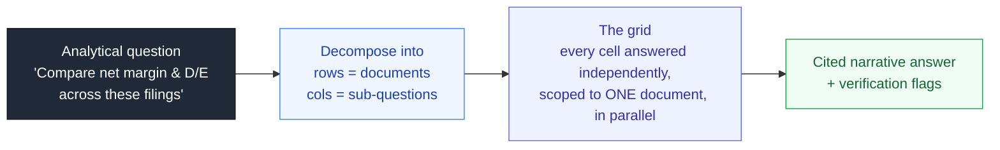

The grid for *"Compare net margin & debt-to-equity across these filings"* (🔵 = pulled from the numeric store, no LLM · 🟢 = deterministically computed):

| Document | Revenue 🔵 | Net income 🔵 | Net margin 🟢 | Debt / equity 🟢 |
|---|---|---|---|---|
| **Acme 10-K** | $33.9B | $4.2B | 12.4% | 0.50x |
| **Beta 10-K** | $21.2B | $1.9B | 9.0% | 0.70x |
| **Gamma Annual** | $8.4B | **— (empty)** | **refused** | 1.08x |

> The Gamma row shows the discipline: Gamma discloses no net income, so its **net income cell is empty (—)** and its **net-margin cell is refused** rather than computed on a guess. Its debt/equity cell still computes because both *its* inputs are present.

---

## 3. System context

How GridFin sits between its inputs (filings, a question, optional model provider) and its outputs (an interactive grid and a CSV export).

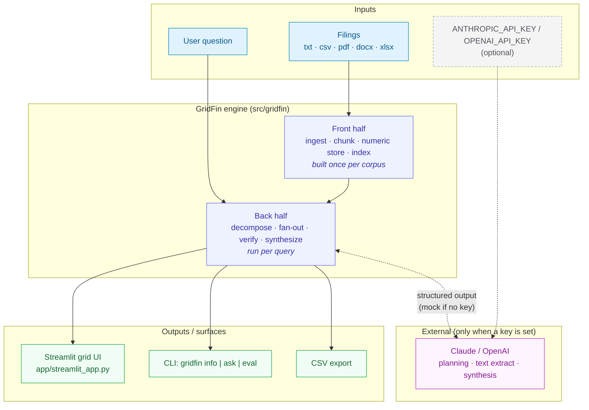

**Key seam:** the LLM is an *optional* collaborator. Without a key (`LLM.live == False`), planning falls back to a deterministic heuristic planner, text cells fall back to the top retrieved snippet, and synthesis falls back to a templated narrative — so the full ten layers still execute. Numbers are **never** the LLM's job in either mode.

---

## 4. End-to-end query-to-answer flow

The canonical path a question takes. The front half is reused across every query; only the back half re-runs.

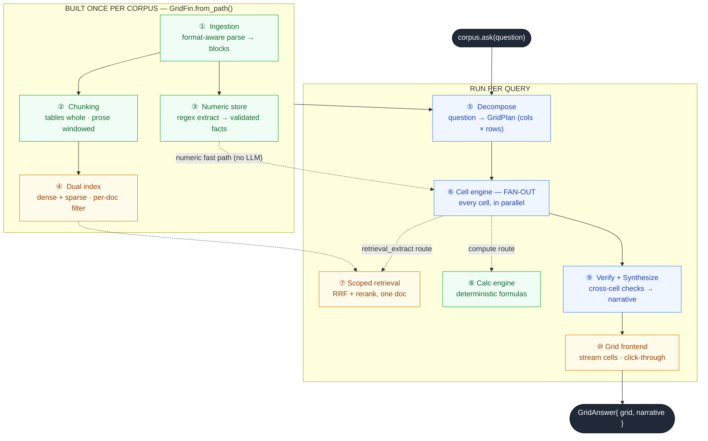

Colour legend: green = front-half build steps, amber = retrieval steps that run
per cell with a document filter, blue = the grid machinery (decompose, fan-out,
verify/synthesize).

---

## 5. The ten-layer pipeline

The pipeline is orchestrated in [`pipeline.py`](../src/gridfin/pipeline.py). Each layer is one module.

| # | Layer | Module |
|---|-------|--------|
| 1 | Format-aware ingestion | [`ingestion/ingest.py`](../src/gridfin/ingestion/ingest.py) |
| 2 | Chunking | [`chunking/chunker.py`](../src/gridfin/chunking/chunker.py) |
| 3 | Structured extraction → numeric store | [`extraction/numeric_store.py`](../src/gridfin/extraction/numeric_store.py) |
| 4 | Dual index + per-document filter | [`indexing/dual_index.py`](../src/gridfin/indexing/dual_index.py) |
| 5 | Query decomposition & grid construction | [`grid/decompose.py`](../src/gridfin/grid/decompose.py) |
| 6 | Per-cell execution engine (fan-out) | [`grid/cell_engine.py`](../src/gridfin/grid/cell_engine.py) |
| 7 | Scoped retrieval & reranking | [`retrieval/retriever.py`](../src/gridfin/retrieval/retriever.py) |
| 8 | Deterministic calculation engine | [`calc/engine.py`](../src/gridfin/calc/engine.py) |
| 9 | Cross-cell verification & synthesis | [`grid/verify.py`](../src/gridfin/grid/verify.py) |
| 10 | Grid front end | [`app/streamlit_app.py`](../app/streamlit_app.py) |

**Cross-cutting:** cell-level caching ([`cache/cell_cache.py`](../src/gridfin/cache/cell_cache.py)), the evaluation harness ([`eval/metrics.py`](../src/gridfin/eval/metrics.py)), the grid store ([`grid/store.py`](../src/gridfin/grid/store.py)), config & capability flags ([`config.py`](../src/gridfin/config.py)), and the tiered LLM client ([`llm/client.py`](../src/gridfin/llm/client.py)).

---

## 6. Front half — built once per corpus (Layers 1–4)

Construction is `GridFin.from_path("data/demo")`. This is the expensive, reusable part: parse → chunk → extract figures → build the searchable index.

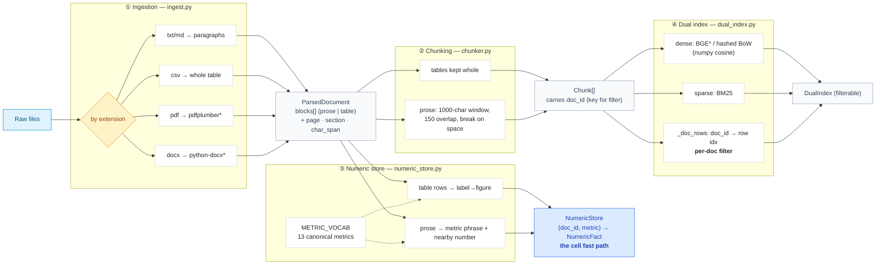
<sub>*optional heavy/ingest dependencies; the demo runs on the pure-Python fallbacks.</sub>

**What each layer guarantees:**

- **① Ingestion** normalizes every format into one `ParsedDocument` schema of `Block`s, each tagged with `page`, `section`, and `char_span` — the provenance that later becomes a cell's `Source`. `doc_id = "{stem}-{sha1(filename)[:8]}"` so ids are reproducible across machines (the eval ground truth references them directly).
- **② Chunking** never splits a table (financial tables lose meaning when cut); prose gets a sliding window with overlap. Every chunk carries `doc_id`, which the per-document filter downstream relies on.
- **③ Numeric store** is the trust engine's supply line. Deterministic regex (`_NUM`, `METRIC_VOCAB`) pulls figures with magnitude suffixes (`$4,200 million` → `4.2e9`) and parenthesis-as-negative handling. Table facts (confidence 0.97) beat prose facts (≤0.92). This store lets numeric cells skip the LLM entirely.
- **④ Dual index** does BGE+BM25 dual retrieval and adds `_doc_rows`, so search can be hard-filtered to a single document before scoring. That filter is what makes cell isolation real.

---

## 7. Back half — run per query (Layers 5–10)

### Layer 5 — Decompose (the brain)

[`decompose.py`](../src/gridfin/grid/decompose.py) turns a free-text question into a strict `GridPlan` (Pydantic): a list of **column specs** (sub-questions / fields) and **row refs** (documents in scope).

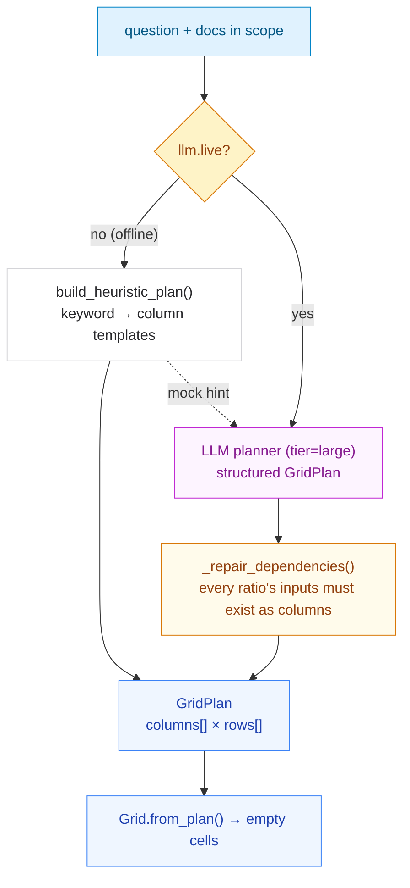

The critical invariant: **a ratio column auto-pulls its input columns**. You cannot compute net margin without a `net_income` column and a `revenue` column in the grid, so the catalog's `requires` (offline) and `_repair_dependencies` (LLM path) guarantee they are present. Columns are typed `numeric | ratio | text` and ordered numeric → ratio → text so figures fill before the ratios that consume them.

### Layers 7 & 8 — the two engines a cell can call

- **Layer 7 (Retrieval)** is now a *subroutine of a cell*: `retriever.retrieve(question, doc_id=…)` does RRF fusion of dense+sparse, then CrossEncoder rerank (or RRF order as fallback) — always within one document.
- **Layer 8 (Calc)** is the determinism boundary: `compute(formula, inputs)` runs a pure function from a fixed library of 11 formulas, returning `formula + inputs + expression + result`, or raising `CalcError` (a *refusal*).

### Layer 9 — Verify & Synthesize

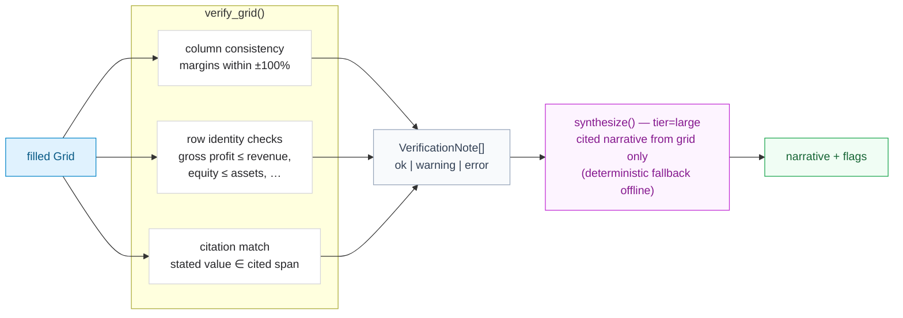

Synthesis is constrained: *"use ONLY the grid below, cite each figure, do not compute new numbers."* The verification flags are passed in so the narrative can surface them.

### Layer 10 — Grid frontend

[`streamlit_app.py`](../app/streamlit_app.py): upload filings or point at a folder, ask a question, watch cells fill, then click any cell to reveal its **value · confidence · route · source span**. Routes are color-coded (🔵 store · 🟠 retrieval · 🟢 compute), mirrored in the CLI's ANSI grid.

---

## 8. The cell — atomic unit of work & audit

Everything good about the grid — parallelism, isolation, caching, traceability — falls out of this one structure ([`models.py`](../src/gridfin/models.py)).

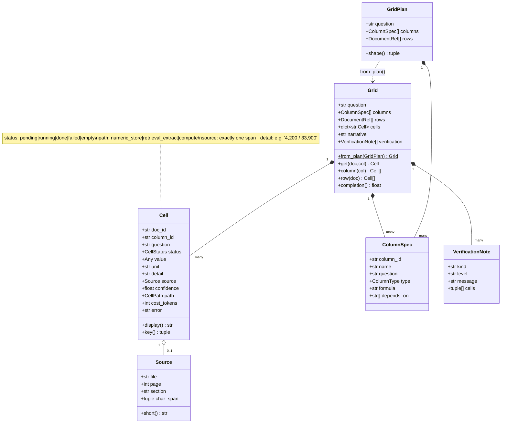

A cell is a **pure function of `(doc_id, column_id)`** — which is precisely why it caches so cleanly and why one document's data can never leak into another's.

---

## 9. Cell routing: the three engines

The heart of the fan-out. `CellEngine._execute_cell` checks the cache, then routes by column type. Each route either produces a `done`/`empty` cell or, on terminal failure, a `failed` cell — but **never an invented number**.

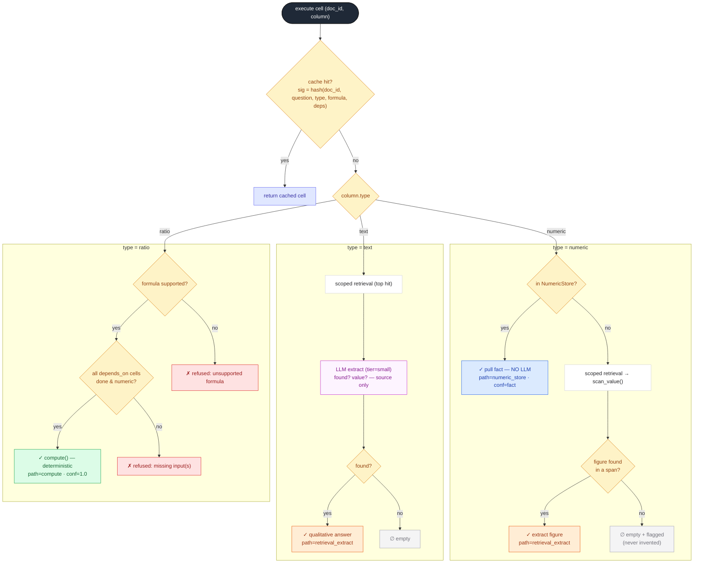

| Route | Cost | When it fires | Guarantee |
|---|---|---|---|
| **`numeric_store`** | **No LLM** (fast path) | numeric metric already extracted at ingest | exact figure + its source span |
| **`retrieval_extract`** | small model (text) / none (numeric scan) | metric/text not pre-extracted | extracted from one document's span, or `empty` |
| **`compute`** | No LLM (pure Python) | ratio columns | `formula + inputs + result`, or `refused` |

Each cell is wrapped in **tenacity retry** (`AsyncRetrying`) that retries only *transient* errors — `_TransientCellError` plus 429/5xx API errors — and never retries 4xx client errors. Terminal failures are recorded as `status="failed"` with the error string.

---

## 10. Two-wave dependency execution

Ratio cells depend on figure cells, so `execute_grid` fills the grid in two dependency-respecting waves. **Both waves are fully parallel internally**, bounded by `asyncio.Semaphore(max_concurrency)`.

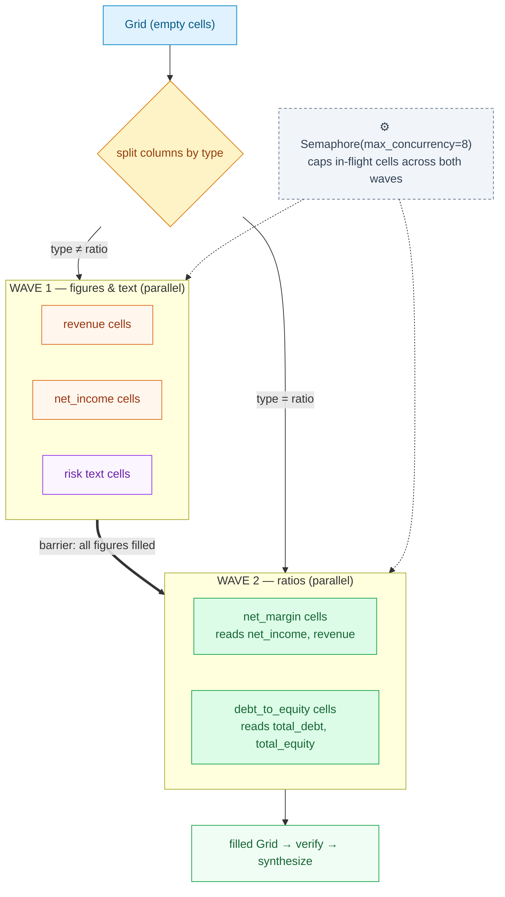

The barrier between waves is the only synchronization point; within a wave, every `(row × column)` cell runs concurrently. The `on_cell` callback fires as each cell completes, which is how the UI streams cells in live.

---

## 11. Request sequence (full trace)

A complete `corpus.ask()` from question to cited answer.

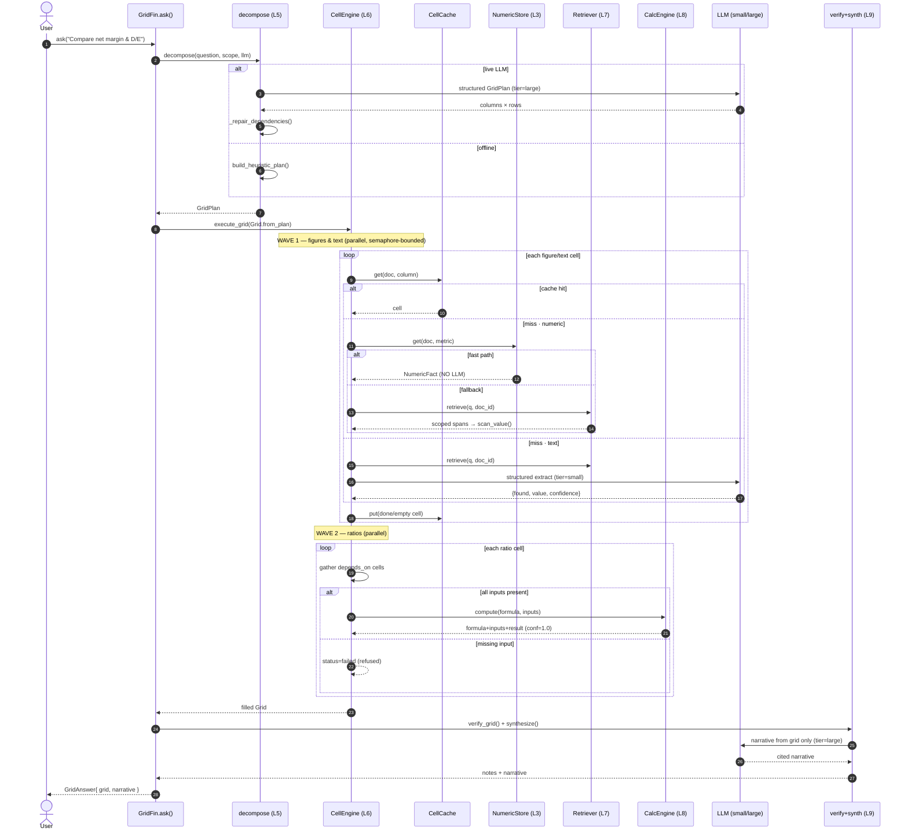

---

## 12. The D × C cost tax & its four mitigations

A grid issues up to **D documents × C columns** model calls, which is the main cost concern. All four mitigations are implemented (`config.py`, `cell_engine.py`, `cell_cache.py`).

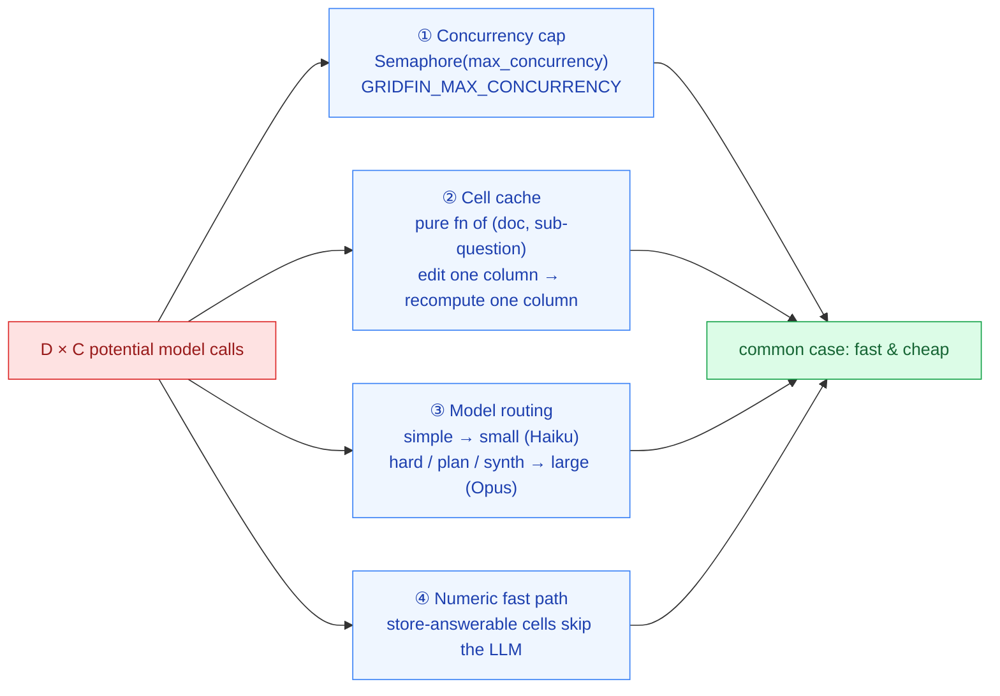

- **Cache signature** deliberately includes column *content* (`question`, `type`, `formula`, `depends_on`), so editing a column's question invalidates only that column's cells. Transient failures are never cached.
- **Routing knobs** live in `Settings`: `model_small` (Haiku 4.5), `model_large` (Opus 4.8), `max_concurrency=8`, `cell_max_retries=3`, `retrieval_k=8`, `rerank_top_n=4`, `rrf_k=60`.

---

## 13. The determinism boundary

The deterministic calculation boundary is the rule I care most about keeping: the
model handles language, but never arithmetic.

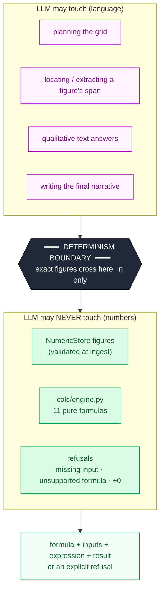

**Contract enforced by `calc/engine.py`:**
- Unsupported formulas → `CalcError` (refused, never approximated).
- Missing / non-numeric inputs → `CalcError` (refused, never guessed).
- `revenue == 0` or any division by zero → refused.
- Every success returns a full audit trail: `formula · inputs · human-readable expression · result · unit`.

Supported formulas: `net_profit_margin`, `gross_margin`, `operating_margin`, `yoy_growth`, `cagr`, `current_ratio`, `debt_to_equity`, `return_on_equity`, `return_on_assets`, `eps` (+ aliases like `roe`, `roa`, `leverage`).

---

## 14. Configuration & deployment modes

GridFin is a **runnable reference implementation**: all ten layers are present, but heavy dependencies degrade gracefully (`config.py` capability flags) so the demo runs with no GPU or model download.

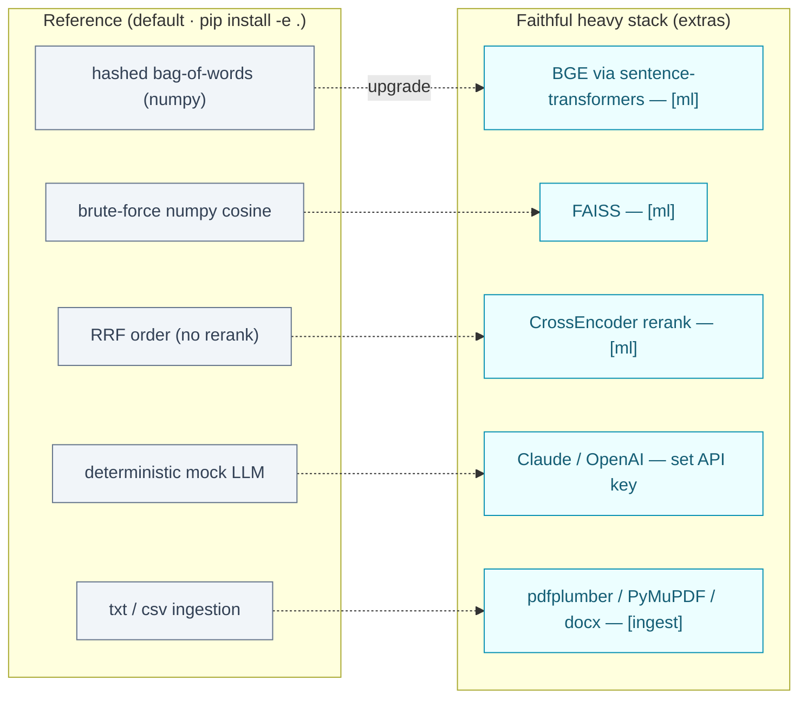

| Mode | Command | LLM | Use |
|---|---|---|---|
| **Offline demo** | `pip install -e .` | deterministic mock | CI, dev, no-network demo |
| **Live models** | copy `.env.example` → `.env`, set key | Claude (Haiku+Opus) / OpenAI | real planning, extraction, synthesis |
| **Heavy retrieval** | `pip install -e ".[ml]"` | — | BGE + FAISS + CrossEncoder |
| **Real documents** | `pip install -e ".[ingest]"` | — | PDF / DOCX / XLSX parsing |
| **Interactive UI** | `pip install -e ".[ui]"` then `streamlit run app/streamlit_app.py` | any | grid with click-through |

Provider/model routing is selected by `llm_provider` (`anthropic`|`openai`); the TLS client is pinned to certifi's CA bundle to avoid macOS `CERTIFICATE_VERIFY_FAILED`.

---

## 15. Evaluation harness

`gridfin eval` ([`eval/metrics.py`](../src/gridfin/eval/metrics.py)) reports the metrics a financial tool actually needs — including the one none of the four RAGAS metrics capture: *is the number right.*

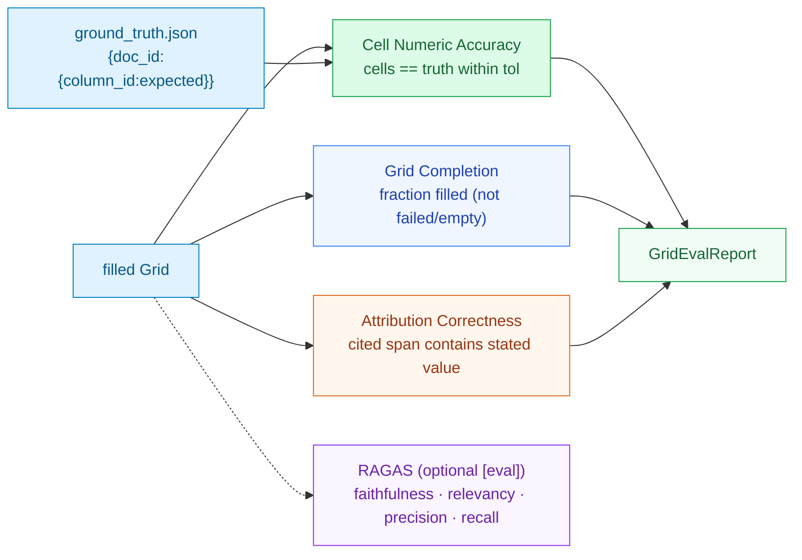

---

## 16. Code map

```
src/gridfin/
  models.py            # grid data model: Cell, Grid, GridPlan, Source, ColumnSpec
  config.py            # settings + optional-dependency capability flags
  pipeline.py          # GridFin: orchestrates all 10 layers (from_path → ask)
  cli.py               # gridfin info | ask | eval  (+ ANSI route-colored grid)
  llm/
    client.py          #   tiered structured-output client (Anthropic | OpenAI)
    mock.py            #   deterministic offline backend
  ingestion/ingest.py  # L1  format-aware parse → ParsedDocument(blocks)
  chunking/chunker.py  # L2  tables whole · prose windowed
  extraction/
    numeric_store.py   # L3  regex figures → NumericStore (cell fast path)
  indexing/
    dual_index.py      # L4  dense + sparse, per-doc filter
    embeddings.py      #     BGE / hashed-BoW embedder
  grid/
    decompose.py       # L5  question → GridPlan
    cell_engine.py     # L6  fan-out: 3 routes, 2 waves, semaphore, retry
    verify.py          # L9  cross-cell checks + synthesize
    store.py           # grid → pandas → CSV export
  retrieval/retriever.py  # L7  RRF + rerank, scoped to one doc
  calc/engine.py       # L8  deterministic formula library (the boundary)
  cache/cell_cache.py  # cell-level diskcache
  eval/metrics.py      # numeric accuracy · completion · attribution
app/streamlit_app.py   # L10 interactive grid (streamlit-aggrid)
data/demo/             # 3 demo filings + ground_truth.json
data/sample/           # extra filings (txt + csv)
tests/                 # extraction · indexing · calc · pipeline · eval
docs/                  # this document
```

---

## 17. Implementation plan & roadmap

The architecture is fully implemented as a reference. This plan organizes **hardening and productionization** into phases. Status reflects the current `Initial commit` baseline.

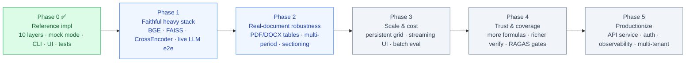

### Phase 0 — Reference implementation ✅ (done)
- All ten layers + cross-cutting cache/eval/store present and wired in `pipeline.py`.
- Offline deterministic mode (mock LLM, hashed embeddings, RRF-only) runs end-to-end.
- CLI (`info`/`ask`/`eval`), Streamlit grid, and unit + integration tests in place.

### Phase 1 — Faithful heavy stack & live LLM
- **Goal:** make the `[ml]` path and live Claude/OpenAI path first-class, not just fallbacks.
- Validate BGE embeddings + FAISS ANN + CrossEncoder rerank against the RRF-only baseline on the demo set.
- End-to-end live-LLM runs for decompose → extract → synthesize; capture token cost per grid.
- Add a smoke test that runs `ask()` against a mocked Anthropic client (assert routing: small for text cells, large for planning/synthesis).
- **Exit:** Cell Numeric Accuracy ≥ baseline with live models; documented cost-per-grid.

### Phase 2 — Real-document robustness
- Harden table extraction for messy PDFs/DOCX (merged cells, multi-column layouts, footnotes).
- Multi-period awareness: today a figure carries an optional `period`; extend the store + grid to expose year-over-year columns (`yoy_growth`, `cagr`) end-to-end.
- Improve `_section_for` and char-span fidelity so citations land on the exact line.
- **Exit:** correct grids on a held-out set of 10+ real 10-Ks.

### Phase 3 — Scale & cost
- Persist filled grids to a queryable store and add a `gridfin query` command for filtering cells (by route, confidence, document).
- True streaming UI: push `on_cell` callbacks to the browser as cells complete (currently filled then rendered).
- Batch evaluation across a question suite with regression tracking.
- **Exit:** a 50-doc × 8-column grid completes within target wall-clock and cost budgets.

### Phase 4 — Trust & coverage
- Expand the formula library (coverage ratios, margins, turnover, EBITDA-derived metrics) — each pure and refusable.
- Richer verification: more accounting identities, cross-document outlier detection, unit-mismatch detection.
- Wire RAGAS as a CI gate behind `[eval]`.
- **Exit:** Attribution Correctness ≥ 0.95 on the demo + sample corpora.

### Phase 5 — Productionize
- Wrap `GridFin` in an async API service (FastAPI) with corpus lifecycle, auth, and per-tenant cache namespaces (the UI already namespaces the cache per upload signature).
- Observability: per-cell timing/cost metrics, structured logs, a cost dashboard for the D×C tax.
- **Exit:** multi-tenant deployment with isolation and cost controls.

---

## 18. Risks & mitigations

| Risk | Impact | Mitigation (status) |
|---|---|---|
| **D × C cost blowup** on large corpora | high | Semaphore + cell cache + model routing + numeric fast path (✅ implemented); cost dashboard (Phase 3/5). |
| **Wrong number reaches the answer** | critical | Determinism boundary: numbers only from store/calc; refusals on missing inputs (✅). Attribution checks in verify (✅). |
| **Bad decomposition** (planner emits wrong/missing columns) | high | `_repair_dependencies` guarantees ratio inputs exist; heuristic fallback; planner uses the frontier model (✅). Add planner eval (Phase 1). |
| **Cross-document contamination** | critical | Mandatory per-doc filter in `DualIndex.search` — no cross-doc search path exists (✅). |
| **Messy real-world tables** mis-extracted | med | Table confidence scoring; tables-over-prose preference; harden in Phase 2. |
| **Stale cache after content change** | med | Cache signature keyed on column content; UI namespaces cache per upload content hash (✅). |
| **API flakiness** | med | Tenacity retry on 429/5xx only; never on 4xx; terminal failures recorded, not invented (✅). |

---

## 19. Testing strategy

Current suite (`tests/`): `test_extraction`, `test_indexing`, `test_calc`, `test_pipeline`, `test_eval` — run with `pytest` (async mode enabled in `pyproject.toml`).

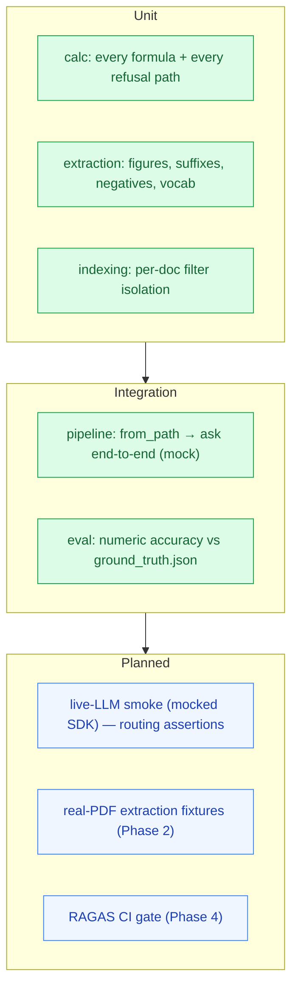

**Invariants worth a dedicated test at every phase:**
1. A missing figure yields `status="empty"`, never a fabricated number.
2. A ratio with a missing input yields `status="failed"` (refused), never a computed guess.
3. Retrieval for `doc_id=A` never returns a chunk from `doc_id=B`.
4. Editing one column's question is a cache miss for that column only.

---

*The diagrams show the design shape; exact ranking, chunking, and prompt details
live in the code. Worth updating these alongside the code when things change.*
